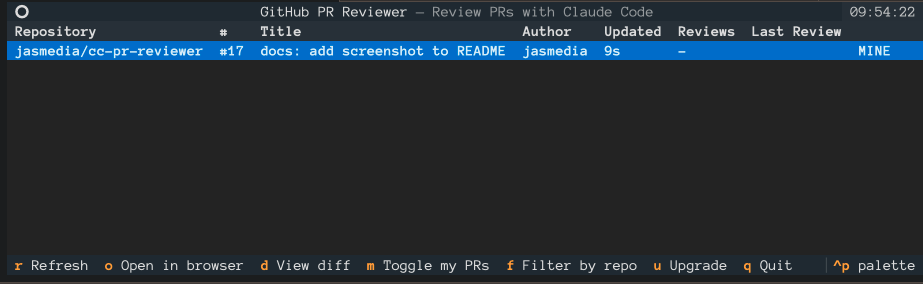

# cc-pr-reviewer

A small Textual TUI that lists every open GitHub PR where you are a
requested reviewer, and hands the selected PR off to Claude Code with the
[PR Review Toolkit](https://claude.com/plugins/pr-review-toolkit) plugin
driving the review.



## What it does

- `gh search prs --review-requested=@me --state=open` fetches your review
  queue across every repo you have access to.
- Displays them in a scrollable table (repo, number, title, author, age,
  draft flag).
- Keyboard-driven: pick a PR and press **Enter** to open a confirmation
  modal; on **Enter/y** it clones the repo (if needed), checks out the PR
  branch via `gh pr checkout`, and launches `claude` inside that working
  tree with a prompt that invokes the PR Review Toolkit agents. See
  [Keybindings](#keybindings) for the full list.

## Prerequisites

All prerequisites are validated at startup via `check_prereqs()`; the TUI
refuses to launch until they're satisfied.

1. **GitHub CLI** — installed and logged in.
   ```sh
   gh auth login
   ```
2. **Claude Code** — the `claude` CLI must be on your `PATH`.
3. **PR Review Toolkit plugin** — installed and enabled inside Claude Code
   (detected via `claude plugin list --json`):
   ```sh
   claude plugin install pr-review-toolkit
   ```
   Details: <https://claude.com/plugins/pr-review-toolkit>
4. **git** — on your `PATH` (used for `git fetch` on repeat reviews).

## Install

### As a global CLI (recommended)

Install from PyPI with [uv](https://docs.astral.sh/uv/) or
[pipx](https://pipx.pypa.io/):

```sh
uv tool install cc-pr-reviewer
# or
pipx install cc-pr-reviewer
```

Then run it from anywhere:

```sh
cc-pr-reviewer
```

### From source (for development)

```sh
uv sync
uv run cc-pr-reviewer
# or
uv run python cc_pr_reviewer.py
```

## Configuration

| Env var            | Default               | Meaning                                    |
| ------------------ | --------------------- | ------------------------------------------ |
| `GH_PR_WORKSPACE`  | `~/gh-pr-workspace`   | Where repos are cloned for local checkout. |

Clones are organised as `$GH_PR_WORKSPACE/<owner>/<repo>`, so a second
review of the same repo reuses the existing clone and just `git fetch`es
before checking out the PR.

## Keybindings

| Key           | Action                                                       |
| ------------- | ------------------------------------------------------------ |
| `↑` / `↓`     | Move through PRs                                             |
| `Enter`       | Confirm, then clone + checkout + launch Claude Code review   |
| `d`           | View full diff                                               |
| `o`           | Open PR in browser                                           |
| `m`           | Toggle inclusion of PRs you authored                         |
| `f`           | Filter the list by repo (picker)                             |
| `r` / `F5`    | Refresh the list                                             |
| `q`           | Quit                                                         |

Inside the confirmation modal: `Enter` / `y` to proceed, `Esc` / `n` / `q`
to cancel, `p` to toggle post-inline (instruct Claude to publish the
findings as inline PR review comments via `gh api`, grouped under one
review). The toggle defaults to on each time the modal opens; the chosen
value is printed before Claude launches.

Inside the filter modal: arrow keys to move, `Enter` to apply the
highlighted repo (or pick **(any repo — clear filter)** to remove the
filter), `r` to re-fetch the unfiltered PR list and pick up repos that
appeared after boot, `Esc` to cancel. The repo list comes from the most
recent unfiltered fetch — applying a filter doesn't shrink the picker.
The active filter is persisted in `$GH_PR_WORKSPACE/.review_state.db`
and restored on the next launch.

## How the Claude launch works

When you press **Enter** on a row, a confirmation modal shows the target
PR (`repo#N` + title). On **Enter/y** the TUI suspends itself and runs,
in order:

```sh
gh repo clone <owner>/<repo>                      # only if not already cloned
git fetch --all --prune                           # otherwise
gh pr checkout <N> --force
claude --permission-mode acceptEdits "<review prompt>"
```

The review prompt asks the PR Review Toolkit to run its six sub-agents
(Comment Analyzer, PR Test Analyzer, Silent Failure Hunter, Type Design
Analyzer, Code Reviewer, Code Simplifier). Because Claude Code starts in
the PR's working tree, it has full file-level context.

`--permission-mode acceptEdits` is always passed so file-edit prompts
don't interrupt the review — the same mode you get with shift+tab
inside a Claude session.

If the modal's **post-inline** checkbox (`p`) is on, the prompt is
extended to ask Claude to publish each finding as an inline review
comment via a single `POST /repos/{owner}/{repo}/pulls/{n}/reviews` call
through `gh api`, so they land grouped under one review.

When you `/exit` Claude, press Enter and the TUI returns.
