# Review user flow

What happens when a user reviews a PR — from pressing the review key through the
confirm/warn modals, the launch orchestration, the agent session, and teardown.
Every node below is traced from `cc_pr_reviewer/__init__.py` (line references in
the source-map at the bottom), not from memory.

```mermaid
flowchart TD
    A([User presses Review key]) --> B["action_review()"]
    B --> C{"_selected()<br/>a PR row?"}
    C -- no --> Z0([return — nothing happens])
    C -- yes --> D{"in-progress cache:<br/>self._in_progress[key]"}

    D -- holder exists --> W["InProgressWarnScreen"]
    W --> WD{override?}
    WD -- no --> Z1([abort])
    WD -- "yes (capture holder)" --> CS
    D -- no holder --> CS["ConfirmScreen modal"]

    subgraph CONFIRM["ConfirmScreen — per-launch choices"]
        CS --> CSi["Ctrl+T post-inline · Ctrl+L cycle CLI<br/>checkboxes pick agents · type extra prompt"]
        CSi --> CSk{Enter / Esc}
    end
    CSk -- "Esc / Ctrl+N (cancel → None)" --> Z2([no launch])
    CSk -- "Enter / Ctrl+Y" --> CR["ConfirmResult<br/>(post_inline, extra_prompt, cli, agents)"]
    CR --> L["_launch_review_cli(pr, …, expected_holder)"]

    L --> PF{"_preflight_cli_checks(cli)"}
    PF -- "fail (toast, TUI alive)" --> Z3([abort])
    PF -- ok --> SUS["self.suspend() — TUI yields TTY"]

    SUS --> RES{"_reserve_in_progress<br/>(same-PR lock)"}
    RES -- "ReviewInProgressError" --> Z4["print holder · wait Enter · return"]

    RES -- reserved --> TRY["set _suspended_for_review = True<br/>(pause auto-refresh)"]
    TRY --> WT{"_prepare_pr_worktree:<br/>clone/fetch primary →<br/>worktree add → gh pr checkout →<br/>rev-parse HEAD"}
    WT -- not ok --> FIN
    WT -- ok --> CG["_setup_codegraph_index<br/>(gated on x toggle):<br/>seed index from primary + sync diff +<br/>collect affected tests"]
    CG --> SK{"cli is skill-based<br/>(codex/gemini)?"}
    SK -- yes --> SKM["_materialise_skills →<br/>.agents/skills/ (snapshot for restore)"]
    SK -- no --> EX
    SKM --> EX["fetch_existing_review_comments<br/>+ _current_gh_login"]
    EX --> SLB{"slack webhook<br/>configured?"}
    SLB -- yes --> SLP["fetch_my_latest_review →<br/>pre-session baseline"]
    SLB -- no --> PB
    SLP --> PB["_resolve_codegraph_tools →<br/>build_review_prompt →<br/>_build_cli_command"]

    PB --> RUN["print banner<br/>rc = subprocess.call(cmd, cwd=worktree)"]
    RUN --> AGENT[["Coding-agent CLI session<br/>(claude / codex / gemini)<br/>user reviews the PR"]]
    AGENT --> TEL["_record_launch_telemetry<br/>(EVERY exit, success or rc≠0)"]

    TEL --> RC{rc == 0?}
    RC -- "no (Ctrl-C / crash)" --> NR["print 'not recording' —<br/>no count++, staleness untouched"]
    RC -- yes --> REC["_record_review:<br/>count++ · reset staleness · store HEAD"]
    REC --> SLN{"slack webhook<br/>configured?"}
    SLN -- yes --> SLNOT["_notify_review_to_slack:<br/>new review id AND newer ts? → post payload"]
    SLN -- no --> WAIT
    SLNOT --> WAIT
    NR --> WAIT["input('Press Enter to return…')"]

    WAIT --> FIN
    Z4 --> FIN
    subgraph TEARDOWN["finally — runs on clean exit, Ctrl-C, and crash"]
        FIN["_cleanup_skills (restore bytes) →<br/>git worktree remove --force →<br/>_release_in_progress →<br/>_suspended_for_review = False"]
    end
    FIN --> RESUME["TUI resumes → action_refresh()"]
    RESUME --> END([Back to PR list])
```

## Notes (load-bearing details)

- **Two-tier in-progress guard.** The `self._in_progress` cache gate is only a
  UX optimisation that surfaces the warn modal early. The *hard* lock is
  `_reserve_in_progress`, taken inside the suspend block — even if the cache
  misses a peer that just started, the reserve raises `ReviewInProgressError`
  and the launch aborts cleanly.
- **Telemetry on every exit.** `_record_launch_telemetry` writes a row for
  *every* exit (success and `rc≠0`), so aborts and crashes stay visible in the
  data. Only a clean `rc == 0` records a *review* (`_record_review`: count++,
  staleness reset, HEAD stored) and is what triggers the Slack notification.
- **Fixed teardown order.** The `finally` block always runs — clean exit,
  Ctrl-C, crash, and the early-return paths (`ReviewInProgressError`, not-ok
  worktree). Order is fixed: restore skills → remove worktree → release the
  reservation → clear the suspend flag, so the slot is never yielded while the
  worktree still exists.
- **Slack is doubly gated.** It fires only when a webhook is configured *and*
  `_notify_review_to_slack` confirms a genuinely new review — a different id
  from the pre-session baseline *and* a newer `submitted_at` timestamp (guards
  the dismiss edge where an older review resurfaces as "latest").
- **Skills are codex/gemini only.** `_materialise_skills` runs only for the
  skill-based CLIs; `claude` drives its sub-agents through the plugin prompt
  instead, so no `.agents/skills/` materialisation happens for it.
- **CodeGraph seeding is gated on the `x` toggle.** When on, the worktree's
  index is seeded from the primary clone and incrementally synced for the PR's
  diff (avoiding a ~30s full re-index per launch); when off, the block is
  skipped entirely.

## Source map

All symbols live in `cc_pr_reviewer/__init__.py`:

| Node | Symbol | Line |
| --- | --- | --- |
| Keypress entry, in-progress gate, modal push | `action_review` | 4521 |
| Per-launch choices payload | `ConfirmResult` | 3176 |
| Confirm modal | `ConfirmScreen` | 3237 |
| In-progress warn modal | `InProgressWarnScreen` | 3400 |
| Launch orchestration + `finally` teardown | `_launch_review_cli` | 5035 |
| Prompt assembly (pure) | `build_review_prompt` | 2200 |
| Slack notification decision | `_notify_review_to_slack` | 4921 |
| Worktree index seed | `_seed_worktree_codegraph` | 1590 |

Other called helpers: `_preflight_cli_checks`, `_reserve_in_progress`,
`_prepare_pr_worktree`, `_setup_codegraph_index`, `_materialise_skills`,
`fetch_existing_review_comments`, `_resolve_codegraph_tools`,
`_build_cli_command`, `_record_launch_telemetry`, `_record_review`,
`_cleanup_skills`, `_release_in_progress`.
